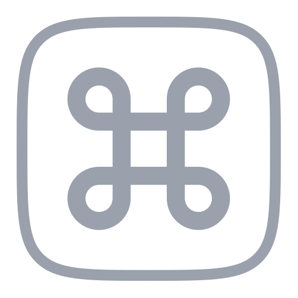

<p align="center">
  
</p>

# jbot-review-action

[](https://github.com/marketplace/actions/j-bot-code-review)
[](LICENSE)

**Open-source agentic PR reviewer — drops into any repo with one workflow
file.** It runs inside your own GitHub Actions, on your runner, with a model
you already pay for: an [OpenCode](https://opencode.ai/) gateway key (Claude,
OpenAI, Gemini, DeepSeek, and 28+ backends), a Poolside API key, or a coding-CLI
account or subscription — Codex (ChatGPT Plus/Pro), Cursor, Devin, Cline, Grok
Build, Kilo, Command Code, or Qoder. Findings
are diff-anchored and adversarially verified before they post. **$0 per
seat** — no reviewer SaaS, no per-review bill.

[Website](https://www.pgupai.com) ·
[Setup guides](https://www.pgupai.com/guides) ·
[Reuse your ChatGPT seat →](https://www.pgupai.com/guides/codex-code-review-github-actions)

## Supported integrations

Each row is a `model` value: the first segment picks the provider, and the
rest is that provider's own model id.

| Integration | Configure with | Status |
| --- | --- | --- |
|  Claude | `model: anthropic/…` | Fully supported |
|  Cline | `model: cline/…` (pay-as-you-go) or `cline-pass/…` (subscription) | Fully supported |
|  Codex | `model: codex/…` | Fully supported |
|  Command Code | `model: commandcode/…` | Fully supported |
|  Cursor | `model: cursor/…` | Fully supported |
|  DeepSeek | `model: deepseek/…` | Fully supported |
|  Devin | `model: devin/…` | Fully supported |
|  Fireworks | `model: fireworks-ai/…` | Fully supported |
|  Gemini | `model: google/…` | Fully supported |
|  GLM | `model: zai-coding-plan/glm-…` or `opencode-go/glm-…` | Fully supported |
|  Grok Build | `model: grok/…` | Fully supported |
|  DimAgent | `model: dim/…` (OAuth plan; bundle credential) | Fully supported |
|  Kilo | `model: kilo/…` (free gateway default) | Fully supported |
|  Kimi | `model: kimi-for-coding/…` (Coding Plan API key) or `opencode-go/kimi-…` | Fully supported |
|  MiniMax | `model: opencode/minimax-…` or `opencode-go/minimax-…` | Fully supported |
|  MiMo | `model: xiaomi-token-plan-sgp/…` or `opencode-go/mimo-…` | Fully supported |
|  NVIDIA | `model: nvidia/…` | Fully supported |
|  OpenAI | `model: openai/…` | Fully supported |
| OpenAI-compatible endpoint | `model: openai-compatible/<your-model>` with a base URL | Fully supported |
|  OpenCode | `model: opencode/…` | Fully supported |
|  OpenCode Go | `model: opencode-go/…` | Fully supported |
|  OpenRouter | `model: openrouter/…` | Fully supported |
|  Poolside | `model: poolside/…` | Fully supported |
|  Qoder | `model: qoder/…` | Fully supported |
|  Qwen | `model: opencode-go/qwen…` | Fully supported |
|  Vercel | `model: opencode/vercel/…` | Fully supported |
|  xAI | `model: xai/…` | Fully supported |

## Usage

Copy [`examples/jbot-review.yml`](examples/jbot-review.yml) into
`.github/workflows/jbot-review.yml`, or use this minimal version:

```yaml
# .github/workflows/jbot-review.yml
name: J-Bot Code Review
on:
  pull_request:
    types: [opened, reopened, ready_for_review, synchronize]

concurrency:
  group: jbot-review-${{ github.event.pull_request.number }}
  cancel-in-progress: true

permissions:
  contents: read
  pull-requests: write
  issues: write # PR reactions (jbot's review-done 🚀) use the issues API
  checks: read

jobs:
  review:
    if: github.event.pull_request.draft == false
    runs-on: ubuntu-latest
    steps:
      - uses: actions/checkout@v7
        with:
          fetch-depth: 0
      - uses: pgup-ai/jbot-review-action@v0 # latest v0.x.y
        with:
          # provider is deprecated — a qualified model selects its own provider.
          provider: ${{ vars.JBOT_REVIEW_PROVIDER || '' }}
          model: ${{ vars.JBOT_REVIEW_MODEL || '' }} # e.g. opencode/deepseek-v4-flash-free
          sdk-engine: ${{ vars.JBOT_SDK_ENGINE || '' }}
          opencode-proxy-url: ${{ secrets.OPENCODE_PROXY_URL }}
          auto-approve: ${{ vars.JBOT_AUTO_APPROVE || 'false' }}
          opencode-api-key: ${{ secrets.OPENCODE_API_KEY }}
          deepseek-api-key: ${{ secrets.DEEPSEEK_API_KEY }}
          openai-api-key: ${{ secrets.OPENAI_API_KEY }}
          openai-compatible-api-key: ${{ secrets.JBOT_OPENAI_COMPATIBLE_API_KEY }}
          openai-compatible-base-url: ${{ vars.JBOT_OPENAI_COMPATIBLE_BASE_URL }}
          anthropic-api-key: ${{ secrets.ANTHROPIC_API_KEY }}
          gemini-api-key: ${{ secrets.GEMINI_API_KEY }}
          openrouter-api-key: ${{ secrets.OPENROUTER_API_KEY }}
          nvidia-api-key: ${{ secrets.NVIDIA_API_KEY }}
          zai-api-key: ${{ secrets.ZAI_API_KEY }}
          kimi-api-key: ${{ secrets.KIMI_API_KEY }}
          xai-api-key: ${{ secrets.XAI_API_KEY }}
          grok-auth: ${{ secrets.GROK_AUTH_JSON }}
          fireworks-api-key: ${{ secrets.FIREWORKS_API_KEY }}
          mimo-api-key: ${{ secrets.MIMO_API_KEY }}
          devin-windsurf-api-key: ${{ secrets.DEVIN_WINDSURF_API_KEY }}
          commandcode-access-key: ${{ secrets.COMMANDCODE_ACCESS_KEY }}
          cursor-api-key: ${{ secrets.CURSOR_API_KEY }}
          poolside-api-key: ${{ secrets.POOLSIDE_API_KEY }}
          qoder-token: ${{ secrets.QODER_PERSONAL_ACCESS_TOKEN }}
          dim-auth: ${{ secrets.DIM_AUTH_BUNDLE }}
          enable-context7: auto
          context7-api-key: ${{ secrets.CONTEXT7_API_KEY }}
          # Recall/precision controls (defaults shown): one general pass,
          # blocking findings adversarially verified before posting.
          # A qualified aux-model (e.g. deepseek/deepseek-v4-flash) runs the
          # auxiliary sessions on the provider it names — useful when the main
          # model is a stronger tier and these checks can stay cheap and fast.
          review-passes: '1'
          verify-findings: 'true'
          aux-provider: ${{ vars.JBOT_AUX_PROVIDER || '' }}
          aux-model: ${{ vars.JBOT_REVIEW_AUX_MODEL || '' }}
          github-token: ${{ secrets.GITHUB_TOKEN }}
          thread-resolution-token: ${{ secrets.JBOT_REVIEW_THREAD_RESOLUTION_TOKEN }}
```

## One-off reviews (`/jbot`)

The [full example workflow](examples/jbot-review.yml) (not the minimal version
above) also lets you trigger a one-off review by commenting on a PR — say, a
final sign-off with a stronger model than the auto-review default:

```
/jbot --model=devin/glm-5.2 --auto-approve
```

- All flags are optional. A flag you pass overrides the repo variable
  (`JBOT_REVIEW_MODEL`, or `JBOT_REVIEW_PROVIDER` for the deprecated
  `--provider`); a flag you omit falls back to it. A qualified `--model`
  selects the backend on its own, so `--provider` is only for legacy pinning.
  Bare `--auto-approve` is equivalent to `--auto-approve=true`; explicit
  `--auto-approve=false` overrides an enabled `JBOT_AUTO_APPROVE` default for
  that run.
  Bare `/jbot` re-runs the review with your configured defaults. The
  command is the first line of the comment: `/jbot` followed only by
  `--provider=<id>`, `--model=<id>`, and `--auto-approve[=true|false]` flags.
  Anything else on that line —
  prose like "/jbot is failing", or an unknown flag — rejects the command
  without spending a review, and lines after the first are ignored.
- A qualified `--model` switches the **provider too** — `--model=devin/glm-5.2`
  routes to Devin with no `--provider`. The exception is a workflow that still
  sets `provider` (or `JBOT_REVIEW_PROVIDER`): that pins the provider, so a
  foreign prefix is sent verbatim and typically 404s. Either way, the provider
  you pick must have its API key wired up in the workflow.
- Only comments from users with repo rights (owner, member, or collaborator —
  GitHub counts read-only org members as members) trigger a run — each run
  spends provider credits. jbot reacts 👀 when it accepts the command; the
  review then posts like any auto-review (the 🚀 review-done reaction appears
  only when no jbot findings remain open).
- **Fork PRs are refused by default.** Unlike `pull_request` runs (where
  GitHub strips secrets on fork PRs), a `/jbot` run executes in base-repo
  context: your provider keys and a write-scoped `GITHUB_TOKEN` sit in the
  review container's environment while it reads the fork's code. Delete the
  `Require same-repo PR head` step in the workflow to allow it, and invoke
  only on fork PRs you've inspected.
- One-off and auto reviews share a concurrency group per PR: a `/jbot` run
  cancels an in-flight auto review of that PR and vice versa. Prior findings
  are not re-posted — a one-off with a stronger model only **adds** what the
  auto-runs missed, which is exactly what a sign-off pass should do.
- Prefer a UI? `workflow_dispatch` (Actions → J-Bot Code Review → *Run
  workflow*) takes the same `provider` / `model` overrides plus a `pr-number`.
- Once the `issue_comment` trigger is installed, every comment in the repo
  records a skipped zero-step run in the Actions tab — expected, free, and
  the reason non-command comments can never cancel a running review.

## Inputs

| Input                        | Required | Default               | Description                                                                                                                                                                                                                                                                                                                                                           |
| ---------------------------- | -------- | --------------------- | --------------------------------------------------------------------------------------------------------------------------------------------------------------------------------------------------------------------------------------------------------------------------------------------------------------------------------------------------------------------- |
| `provider`                   | No       | from `model`          | Deprecated — qualify `model` instead; pins both models when set (`JBOT_REVIEW_PROVIDER`). Valid ids: opencode, opencode-go, deepseek, openai, openai-compatible, anthropic, google, openrouter, nvidia, zai-coding-plan, kimi-for-coding, xai, xiaomi-token-plan-sgp, fireworks-ai, poolside, devin, commandcode, cursor, qoder, dim, codex, cline, cline-pass, grok, kilo |
| `model`                      | No       | `opencode` default    | `provider/model` reference, or a comma-separated pool that may span providers; required for `openai-compatible`                                                                                                                                                                                                                                                       |
| `sdk-engine`                 | No       | `auto`                | `auto` uses pi for cataloged models; `opencode` pins SDK sessions to OpenCode                                                                                                                                                                                                                                                                                         |
| `opencode-proxy-url`         | No       | —                     | Optional HTTP/HTTPS proxy URL for OpenCode; verified against `api.ipify.org`, ignored for fork-head PRs, and skipped without failing the review when unavailable                                                                                                                                                                                                       |
| `opencode-api-key`           | No       | —                     | Used when the main or aux model names `opencode`/`opencode-go`                                                                                                                                                                                                                                                                                                        |
| `deepseek-api-key`           | No       | —                     | Used when the main or aux model names `deepseek`                                                                                                                                                                                                                                                                                                                      |
| `openai-api-key`             | No       | —                     | Used when the main or aux model names `openai`                                                                                                                                                                                                                                                                                                                        |
| `openai-compatible-api-key`  | No       | —                     | Namespaced key for `openai-compatible`                                                                                                                                                                                                                                                                                                                                |
| `openai-compatible-base-url` | No       | —                     | Required endpoint URL for `openai-compatible`                                                                                                                                                                                                                                                                                                                         |
| `anthropic-api-key`          | No       | —                     | Used when the main or aux model names `anthropic`                                                                                                                                                                                                                                                                                                                     |
| `gemini-api-key`             | No       | —                     | Used when the main or aux model names `google`                                                                                                                                                                                                                                                                                                                        |
| `openrouter-api-key`         | No       | —                     | Used when the main or aux model names `openrouter`                                                                                                                                                                                                                                                                                                                    |
| `nvidia-api-key`             | No       | —                     | Used when the main or aux model names `nvidia`                                                                                                                                                                                                                                                                                                                        |
| `zai-api-key`                | No       | —                     | Used when the main or aux model names `zai-coding-plan`                                                                                                                                                                                                                                                                                                               |
| `kimi-api-key`               | No       | —                     | Used when the main or aux model names `kimi-for-coding`                                                                                                                                                                                                                                                                                                               |
| `xai-api-key`                | No       | —                     | Used by `xai`, or by `grok` when `grok-auth` is empty                                                                                                                                                                                                                                                                                                                 |
| `fireworks-api-key`          | No       | —                     | Used when the main or aux model names `fireworks-ai`                                                                                                                                                                                                                                                                                                                  |
| `mimo-api-key`               | No       | —                     | Used when the main or aux model names `xiaomi-token-plan-sgp`                                                                                                                                                                                                                                                                                                         |
| `devin-windsurf-api-key`     | No       | —                     | Used when the main or aux model names `devin`                                                                                                                                                                                                                                                                                                                         |
| `commandcode-access-key`     | No       | —                     | Used when the main or aux model names `commandcode`                                                                                                                                                                                                                                                                                                                   |
| `cursor-api-key`             | No       | —                     | Used when the main or aux model names `cursor`                                                                                                                                                                                                                                                                                                                        |
| `poolside-api-key`           | No       | —                     | Used when the main or aux model names `poolside`                                                                                                                                                                                                                                                                                                                      |
| `qoder-token`                | No       | —                     | Used when the main or aux model names `qoder`                                                                                                                                                                                                                                                                                                                         |
| `codex-auth`                 | No       | —                     | Codex CLI auth (contents of `~/.codex/auth.json`); used when the main or aux model names `codex`                                                                                                                                                                                                                                                                      |
| `cline-auth`                 | No       | —                     | Cline CLI auth (contents of `~/.cline/data/settings/providers.json`); used when the main or aux model names `cline` / `cline-pass`                                                                                                                                                                                                                                    |
| `grok-auth`                  | No       | —                     | Grok account auth (contents of `~/.grok/auth.json`); preferred over `xai-api-key` when `grok` is selected                                                                                                                                                                                                                                                             |
| `kilo-auth`                  | No       | —                     | Kilo CLI auth (contents of `~/.local/share/kilo/auth.json`); used when the main or aux model names `kilo`                                                                                                                                                                                                                                                             |
| `dim-auth`                   | No       | —                     | DimAgent CLI auth — the bundle printed by `npm run dim:bundle` in [pgup-ai/jbot-review](https://github.com/pgup-ai/jbot-review) (`auth.json` plus the pruned provider store); used when the main or aux model names `dim`                                                                                                                                                                                                                    |
| `enable-context7`            | No       | `auto`                | Use Context7 MCP for external contract changes; `auto`, `true`, or `false`                                                                                                                                                                                                                                                                                            |
| `context7-api-key`           | No       | —                     | Optional Context7 key for reliable CI docs lookup                                                                                                                                                                                                                                                                                                                     |
| `github-token`               | Yes      | `${{ github.token }}` | Token for posting the review                                                                                                                                                                                                                                                                                                                                          |
| `thread-resolution-token`    | No       | —                     | Optional token for resolving threads and minimizing completed reviews                                                                                                                                                                                                                                                                                                 |
| `pr-number`                  | No       | —                     | PR number for manual `workflow_dispatch` runs                                                                                                                                                                                                                                                                                                                         |
| `dry-run`                    | No       | `false`               | Log review output without posting comments                                                                                                                                                                                                                                                                                                                            |
| `auto-approve`               | No       | `false`               | Approve an eligible exact reviewed head when no new or open jbot findings remain                                                                                                                                                                                                                                                                                      |
| `max-findings`               | No       | `0`                   | Maximum findings to post; `0` means no limit                                                                                                                                                                                                                                                                                                                          |
| `min-severity`               | No       | `nit`                 | Minimum severity to include: `P0`, `P1`, `P2`, `P3`, or `nit`                                                                                                                                                                                                                                                                                                         |
| `include-prior-comments`     | No       | `true`                | Include prior PR review comments in context                                                                                                                                                                                                                                                                                                                           |
| `enable-guideline-pass`      | No       | `true`                | Run a dedicated guideline-compliance pass when repository guidelines are discovered                                                                                                                                                                                                                                                                                   |
| `aux-model`                  | No       | —                     | Auxiliary-session model as `provider/model`, or a pool like `model` that may span providers; a bare id follows `aux-provider`, else the deprecated `provider` pin, else the picked main model; uses the main model when unset                                                                                                                                         |
| `aux-provider`               | No       | from `aux-model`      | Deprecated — qualify `aux-model` instead; pins only the aux provider when set (`JBOT_AUX_PROVIDER`)                                                                                                                                                                                                                                                                   |
| `review-passes`              | No       | `1`                   | Total review passes, 1-3. Raise to 2-3 for extra recall lenses                                                                                                                                                                                                                                                                                                        |
| `verify-findings`            | No       | `true`                | Re-check blocking findings before posting; uncertain findings become advisory                                                                                                                                                                                                                                                                                         |
| `time-budget-minutes`        | No       | `30`                  | Wall-clock target in minutes; `0` disables budget-derived session timeouts                                                                                                                                                                                                                                                                                            |
| `review-shards`              | No       | `1`                   | Parallel main-review shards. `1` = single full-diff session (default); `0` auto-scales by diff size, capped at 4. Only speeds up on providers with real session concurrency; free/throttled tiers serialize shards on one key                                                                                                                                         |
| `model-options`              | No       | Provider-dependent    | JSON options for the main model; native providers default to `{"reasoningEffort":"medium"}`, Poolside uses `{"reasoningEffort":"default"}`, and custom providers use `{}`                                                                                                                                                                                             |
| `prompt-cache`               | No       | `true`                | Prompt caching for OpenCode-server sessions (`setCacheKey`); cuts input-token cost on models that honor it; models marked unsupported omit the cache key. The default pi engine caches provider-side automatically, so this only affects the OpenCode-server path                                                                                                     |
| `skip-doc-only`              | No       | `true`                | Skip the review (no model call) when the PR changes only documentation/diagram assets (`.md`, `.svg`, `.drawio`, `.pdf`, …); the reaction is left unchanged (a docs push does not change the verdict)                                                                                                                                                                 |
| `max-concurrent-sessions`    | No       | `3`                   | Max model sessions in flight (default `3`); `0` = unlimited                                                                                                                                                                                                                                                                                                           |
| `review-telemetry`           | No       | `true`                | Emit per-finding + per-session telemetry to `.jbot-review/telemetry.jsonl`                                                                                                                                                                                                                                                                                            |
| `evidence-quotes`            | No       | `true`                | Ask each finding to carry a verbatim quote of the changed line it flags                                                                                                                                                                                                                                                                                               |
| `fail-on-error`              | No       | `true`                | Fail the workflow when review cannot complete                                                                                                                                                                                                                                                                                                                         |

## Outputs

| Output            | Description                                                                         |
| ----------------- | ----------------------------------------------------------------------------------- |
| `findings-posted` | Findings posted, or logged in dry-run. Unset if the review fails before completing. |
| `terminal-state`  | `completed` when the review pipeline finishes; `failed` when it aborts.             |

With `auto-approve: true`, a clean run approves only the exact reviewed head
when every prior jbot thread is resolved and GitHub reports the PR open,
non-draft, and mergeable. Branch protection, required checks, and other merge
requirements still apply.

See the generated [J-Bot model ID catalog](https://github.com/pgup-ai/jbot-review/blob/main/MODEL_CATALOG.md)
for current Models.dev and CLI-backed model IDs.
Use repository or organization Actions variables `JBOT_REVIEW_MODEL`,
`JBOT_REVIEW_AUX_MODEL`, and `JBOT_SDK_ENGINE` to change future review runs
without editing workflow YAML. (`JBOT_REVIEW_PROVIDER` / `JBOT_AUX_PROVIDER`
still work, but a qualified model makes them unnecessary.)
The action uses the key matching the main model's provider, plus the aux
provider's key when `aux-model` names a different one. The example can pass
multiple provider secrets and leave unused ones empty. Models come from either
action inputs or environment variables: `model` or `JBOT_REVIEW_MODEL` for the
main model, and `aux-model` or `JBOT_REVIEW_AUX_MODEL` for the auxiliary one.

A comma-separated `model` is a pool: each run reviews with one candidate,
chosen by hashing the PR head sha. Load spreads across the pool as PRs and
pushes come in, while re-reviewing the same commit always picks the same model,
so a rerun reproduces. Every candidate is validated before the review starts.
The chosen model is logged and appears in the posted review's metadata block.

**Candidates may name different providers.** Only one runs per PR, and each
provider's key is resolved separately, so a pool can mix them — every provider
a pool draws on needs its own key, and a candidate that cannot run is a
configuration error rather than silently skipped.

`aux-model` takes a pool on the same terms. Its pick is salted, so setting both
inputs to the same list still varies the pair instead of always drawing the
same two entries.

```yaml
model: opencode/deepseek-v4-flash-free,opencode/glm-5-free,opencode/kimi-k2.5-free
```

Auxiliary sessions use `aux-model` or `JBOT_REVIEW_AUX_MODEL` when set,
otherwise the main model. An aux model naming no provider stays on the main
provider.
Provider API keys can also be supplied through their standard env vars, such as
`GEMINI_API_KEY`, `OPENROUTER_API_KEY`, `NVIDIA_API_KEY`, `ZAI_API_KEY`,
`KIMI_API_KEY`, `POOLSIDE_API_KEY`, `JBOT_OPENAI_COMPATIBLE_API_KEY`,
`FIREWORKS_API_KEY`,
`DEVIN_WINDSURF_API_KEY`, or `QODER_PERSONAL_ACCESS_TOKEN`. Custom endpoints
also read `JBOT_OPENAI_COMPATIBLE_BASE_URL`. `opencode-go` uses the same
`OPENCODE_API_KEY` as
`opencode`.
Use a `model` on `kimi-for-coding` with `kimi-api-key` / `KIMI_API_KEY` for the
native Kimi Coding Plan provider. Its current default is `kimi-for-coding/k3`:

```yaml
with:
  model: kimi-for-coding/k3
  kimi-api-key: ${{ secrets.KIMI_API_KEY }}
```

For an arbitrary OpenAI-compatible endpoint, provide the model, namespaced key,
and base URL explicitly:

```yaml
with:
  model: openai-compatible/my-served-model
  openai-compatible-api-key: ${{ secrets.JBOT_OPENAI_COMPATIBLE_API_KEY }}
  openai-compatible-base-url: ${{ vars.JBOT_OPENAI_COMPATIBLE_BASE_URL }}
```

These settings never fall back to `OPENAI_API_KEY` or `OPENAI_BASE_URL`, so the
direct `openai` provider remains isolated. J-Bot omits `setCacheKey` for both
providers; generic endpoints may reject that extra request field, and Kimi's
catalog does not advertise support for it. When `openai-compatible` is the
auxiliary provider, pass its namespaced key and base URL alongside
`aux-provider` and `aux-model`.

Use a `model` on `devin` with `devin-windsurf-api-key` /
`DEVIN_WINDSURF_API_KEY` for the Devin CLI backend — the secret is the
`windsurf_api_key` value (`devin-session-token$…`) from
`~/.local/share/devin/credentials.toml` after `devin auth login`.
Use a `model` on `commandcode` with `commandcode-access-key` /
`COMMANDCODE_ACCESS_KEY` for the CommandCode CLI backend — the `apiKey`
value (`user_…`) from `~/.commandcode/auth.json`.
Use a `model` on `cursor` with `cursor-api-key` / `CURSOR_API_KEY` for the Cursor
CLI backend. It authenticates straight from `CURSOR_API_KEY` and runs read-only
(`cursor-agent --mode plan`).
Use a `model` on `poolside` with `poolside-api-key` / `POOLSIDE_API_KEY` for the
Poolside inference provider. Its default model is `poolside/laguna-s-2.1`, and
reasoning stays provider-managed unless `model-options.reasoningEffort` overrides
it.
Use a `model` on `qoder` with `qoder-token` / `QODER_PERSONAL_ACCESS_TOKEN` for the
Qoder CLI backend. It accepts `auto`, `ultimate`, `performance`, `efficient`,
and `lite` model tiers.
Use a `model` on `codex` with `codex-auth` / `CODEX_AUTH_JSON` (the contents of
`~/.codex/auth.json` from a ChatGPT Plus/Pro `codex login`) for the Codex CLI
backend. It runs read-only (`codex exec --sandbox read-only`).
Use a `model` on `cline` (pay-as-you-go) or `cline-pass` (Cline subscription)
with `cline-auth` / `CLINE_AUTH_JSON` (the contents of
`~/.cline/data/settings/providers.json` from a local `cline auth`) for the Cline CLI
backend. The two billing modes are separate providers sharing the one secret; both run
read-only (`cline --plan --auto-approve false`) and use only the auth token. Set `model`
as `cline/<type>/<model>` (e.g. `cline/deepseek/deepseek-v4-flash`) or
`cline-pass/<model>` (e.g. `cline-pass/glm-5.2`); omit it to use each mode's default.
Use a `model` on `grok` with `grok-auth` / `GROK_AUTH_JSON` (the contents of
`~/.grok/auth.json` after `grok login --device-auth`) for the Grok Build CLI backend.
If both credentials are supplied, account auth takes precedence over `xai-api-key` /
`XAI_API_KEY`.
Use a `model` on `kilo` with `kilo-auth` / `KILO_AUTH_CONTENT` (the contents of
`~/.local/share/kilo/auth.json`) for the Kilo CLI backend; it defaults to the free
`kilo/kilo-auto/free` gateway model.
Use a `model` on `dim` with `dim-auth` / `DIM_AUTH_BUNDLE` for the DimAgent CLI
backend, e.g. `dim/dimcode-api-oauth/deepseek-v4-flash`. Its plan is OAuth-only,
so the credential is not a key: authenticate once with
`dim auth login --device-login --provider dimcode-api-oauth`, then run
`npm run dim:bundle` in [pgup-ai/jbot-review](https://github.com/pgup-ai/jbot-review)
and store its output. The bundle carries `auth.json` **and** the pruned provider
store, because `auth.json` alone leaves dim reporting `No connected provider`.
This convenience pattern exposes every configured provider key to the action
runtime. For a least-privilege setup, pass only the selected provider's key and,
when needed, the aux provider's key:

```yaml
with:
  model: ${{ vars.JBOT_REVIEW_MODEL || '' }} # e.g. opencode/deepseek-v4-flash-free
  opencode-api-key: ${{ secrets.OPENCODE_API_KEY }}
  github-token: ${{ secrets.GITHUB_TOKEN }}
```

Set `enable-context7: auto` and pass `context7-api-key` from
`secrets.CONTEXT7_API_KEY` to let the review agent verify current docs when the
PR changes external API, SDK, framework, CLI, cloud-service, or GitHub Actions
usage. Context7 is skipped for ordinary business-logic changes, and Context7
MCP failures are non-blocking.

When jbot verifies a prior finding is fixed, it posts an addressed reply and
then attempts to resolve the GitHub review thread. Some `GITHUB_TOKEN`
integrations can post review comments but cannot run GitHub's
`resolveReviewThread` mutation. If you see `Resource not accessible by
integration` in the logs, add a secret such as
`JBOT_REVIEW_THREAD_RESOLUTION_TOKEN` with a PAT or GitHub App token that can
resolve PR review threads, then pass it through `thread-resolution-token`.

When `aux-model` names a different provider than the main model, that
provider's own key input or env var is required — a key is never reused across
providers.
CLI backends cannot reuse opencode-provider keys, and opencode-backed providers
cannot reuse CLI credentials such as `DEVIN_WINDSURF_API_KEY`,
`COMMANDCODE_ACCESS_KEY`, `CURSOR_API_KEY`, `QODER_PERSONAL_ACCESS_TOKEN`, or
`GROK_AUTH_JSON`, so mixed CLI/opencode-backed
main+aux configurations must pass both keys.

A model is written `provider/model`, and only the **first** slash splits it: the
first segment picks the provider, and everything after it is that provider's own
model id, which may contain further slashes. So `kilo/zai/glm-5.2` and
`devin/glm-5.2` are distinct routes to what may be the same underlying model,
and `nvidia/moonshotai/kimi-k2.6` keeps its publisher prefix intact. A model id
with no provider segment falls back to `opencode`.

The legacy `provider` / `aux-provider` inputs still work and keep the previous
resolution exactly. Setting either one pins the provider: an unprefixed id
belongs to it, a matching `provider/` prefix is stripped, and any other slash
prefix stays part of the model id. `provider` pins both models; `aux-provider`
pins only `aux-model`. New setups should qualify both models and drop both
inputs.

Migrating from `api-key`: replace the old unified `api-key` input with the
matching provider-specific input, such as `opencode-api-key` for a model on
`opencode`. The unified input is not read by current `v0` builds.

## FAQ

**Can I use my ChatGPT Plus/Pro, Cursor, or other CLI account for code review?**
Yes — that's the point. Codex (via a ChatGPT Plus/Pro `codex login`), Cursor,
Devin, Cline, Grok Build, Kilo, Command Code, and Qoder accounts all work as review backends. Claude
runs through your own Anthropic API key or an OpenCode gateway instead — a
Claude Pro/Max seat is not a supported CI credential today. Per-CLI setup:
[pgupai.com/guides](https://www.pgupai.com/guides).

**Does my code get uploaded to a third-party service?**
There is no hosted reviewer in the loop, and the checkout never leaves your
GitHub Actions runner. What does leave is the diff, plus whatever context the
reviewing agent requests — sent only to the model provider you configured, on
your own key or seat.

**What does it cost?**
The action is MIT-licensed and adds no per-seat or per-review charge. You pay
only the model you bring — $0 with OpenCode Zen free models or a CLI seat you
already pay for — plus normal CI minutes.

**Can the action modify my code?**
No. The checkout is read-only, and nothing in the example workflows can push
code: they request `contents: read`, plus `pull-requests: write` (review
comments), `issues: write` (PR reactions), and `checks: read`. On
`pull_request` events GitHub strips secrets from fork PRs.

**What runs the review under the hood?**
Model-key providers route automatically through the in-process
[pi](https://pi.dev/) SDK when its catalog contains the selected model and the
OpenCode server otherwise; `kimi-for-coding` and `openai-compatible` use
OpenCode, while Poolside uses its direct chat-completions backend. Set
`sdk-engine: opencode` to pin all eligible SDK sessions to OpenCode.
Coding-CLI backends (Codex, Cursor, Devin, Cline, Grok Build, Kilo, Command
Code, Qoder) run their own CLI. Every path remains read-only, and the review
footer names the engine that ran each session.

**How is this different from hosted reviewers like CodeRabbit or Greptile?**
Hosted reviewers run your code through their own servers and charge per seat;
this is an open action in your CI with any model, at $0/seat. It also reads
existing `.coderabbit.yaml` and `greptile.json` rule files, so switching keeps
your house rules. Side-by-side comparisons:
[CodeRabbit](https://www.pgupai.com/compare/coderabbit-alternative) ·
[Greptile](https://www.pgupai.com/compare/greptile-alternative) ·
[Qodo](https://www.pgupai.com/compare/qodo-alternative) ·
[Cubic](https://www.pgupai.com/compare/cubic-alternative)

## Versioning

This project is in beta. Tags follow [SemVer](https://semver.org/): pinned to
`v0.1.0` for now. While in `0.x.y`, breaking changes may ship on any minor
bump. The first `v1.0.0` will mark API stability.

Pin to a specific tag for reproducibility. To track the latest beta:

```yaml
- uses: pgup-ai/jbot-review-action@v0
  # equivalent to the latest v0.x.y release
```
